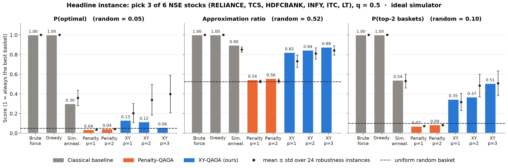

<div align="center">

# Q-Folio — Constraint-Preserving QAOA for Portfolio Selection

**Qiskit Fall Fest 2026 · Quantum Build Challenge · Industry Track I2 (Portfolio Optimizer)**

[](https://github.com/achintya007-arch/qfolio/actions/workflows/ci.yml)
[](https://achintya007-arch.github.io/qfolio/)
[](https://qfolio.streamlit.app)


[](LICENSE)

*Pick the best **k of n** stocks (return up, risk down) with QAOA on Qiskit, then check it against an exact classical baseline, a noisy simulator and real IBM quantum hardware.*

</div>

---

## TL;DR

| | |
|---|---|
| **Problem** | A robo-advisor must choose *k* of *n* assets to maximise return minus risk (cardinality-constrained Markowitz). The problem is NP-hard in general. |
| **Quantum approach** | QAOA with an **XY-ring mixer and a Dicke-state initial state**. This keeps the "exactly *k* assets" constraint *inside the circuit* instead of adding it to the cost as a penalty term. |
| **Key finding** | In validation runs, the standard penalty-QAOA did **no better than random guessing**. The constraint-preserving XY-QAOA sampled the true optimum **~7× more often than random** and returned 100% valid portfolios. |
| **Noise-aware layer** | Transpiler tuning, **symmetry post-selection** (wrong Hamming weight → discard), readout mitigation and dynamical decoupling, run on noisy simulation **and real IBM hardware**. |
| **Honesty** | At 4–6 assets, brute force solves this in microseconds. **We do not claim quantum advantage.** The [Limits](#limits) section explains what would need to change for that. |

> ⚠️ Every number in the [Results](#results) section is produced by `make reproduce` and stored in `results/`. Placeholders marked `⟨…⟩` are filled in automatically by the pipeline.

## Results

| Method | P(optimal) | Approx. ratio | Valid portfolios | Wall time |
|---|---|---|---|---|
| Random feasible guess | ⟨1/C(n,k)⟩ | — | 100% | — |
| Brute force (exact) | 1.000 | 1.000 | 100% | ⟨…⟩ |
| Simulated annealing (same QUBO) | ⟨…⟩ | ⟨…⟩ | ⟨…⟩ | ⟨…⟩ |
| Greedy heuristic | ⟨…⟩ | ⟨…⟩ | 100% | ⟨…⟩ |
| Penalty-QAOA (X mixer), p=2 | ⟨…⟩ | ⟨…⟩ | ⟨…⟩ | ⟨…⟩ |
| **XY-QAOA (Dicke init), p=2** | ⟨…⟩ | ⟨…⟩ | ⟨…⟩ | ⟨…⟩ |
| XY-QAOA on IBM noise model | ⟨…⟩ | ⟨…⟩ | ⟨…⟩ | — |
| **XY-QAOA on `ibm_⟨backend⟩` (real)** | ⟨…⟩ | ⟨…⟩ | ⟨…⟩ | job `⟨id⟩` |

<p align="center"></p>

Full interactive report: **https://achintya007-arch.github.io/qfolio/**

## Quickstart

```bash
git clone https://github.com/achintya007-arch/qfolio.git && cd qfolio
python -m venv .venv && source .venv/bin/activate      # Windows: .venv\Scripts\activate
pip install -r requirements.txt
make reproduce          # data (cached) → baselines → QAOA → noisy sim → figures   (~5 min on a laptop)
jupyter lab notebooks/qfolio.ipynb
streamlit run app/streamlit_app.py
```

Everything runs offline on simulators. Market data is cached in `data/prices.csv`, so a rerun never needs the network.
Real hardware is optional and needs an IBM Quantum account. See [docs/06_HARDWARE_RUNBOOK.md](docs/06_HARDWARE_RUNBOOK.md).

## Repository map

```
qfolio/
├── src/qportfolio/        # the library: problem → QUBO/Ising → circuits → QAOA → metrics
├── notebooks/qfolio.ipynb # the submission notebook (narrative + results)
├── app/streamlit_app.py   # live demo
├── scripts/               # fetch_data, run_benchmark, run_noisy, run_hardware, build_report
├── configs/default.yaml   # every experiment parameter in one place
├── data/                  # cached public prices + data card
├── results/               # JSON metrics, figures, hardware job IDs + raw counts (evidence)
├── tests/                 # pytest: QUBO correctness, Dicke state, weight conservation, …
├── docs/                  # spec, architecture, methodology, runbooks, brief, ADRs
└── .github/workflows/     # CI (lint, test, notebook) + Pages deploy
```

## Documentation

| Doc | What it covers |
|---|---|
| [00 Plan](docs/00_PLAN.md) | Hour-by-hour build plan to the deadline, checkpoints, definition of done |
| [01 Spec](docs/01_SPEC.md) | Requirements, scope, acceptance criteria |
| [02 Architecture](docs/02_ARCHITECTURE.md) | Modules, data flow, interfaces |
| [03 Methodology](docs/03_METHODOLOGY.md) | Markowitz → QUBO → Ising → QAOA; XY mixer; metrics |
| [04 Implementation notes](docs/04_IMPLEMENTATION_NOTES.md) | Verified Qiskit 2.x reference code and the pitfalls we hit |
| [05 Benchmark protocol](docs/05_BENCHMARK_PROTOCOL.md) | How we keep the quantum vs classical comparison fair |
| [06 Hardware runbook](docs/06_HARDWARE_RUNBOOK.md) | IBM Quantum account, token safety, job submission, evidence |
| [07 CI/CD & deployment](docs/07_CI_CD_AND_DEPLOYMENT.md) | GitHub Actions, Pages report, Streamlit deploy, releases |
| [08 Testing](docs/08_TESTING.md) | Test strategy and what each test proves |
| [09 Rubric map](docs/09_RUBRIC_MAP.md) | Each judging criterion → the evidence in this repo |
| [Business brief](docs/BUSINESS_BRIEF.md) | One-page brief: customer, cost of problem, result, limits |
| [Demo script](docs/DEMO_SCRIPT.md) | 2-minute video script + 3-slide outline + 3-minute live demo |
| [ADRs](docs/adr/) | Architecture decisions and why |
| [Claude Code prompts](docs/CLAUDE_CODE_PROMPTS.md) | The phase-by-phase build prompts used to build this repo |
| [Data card](data/README.md) | Source, universe, period, licence |

## Limits

- **Size:** 4–6 assets (4–6 qubits). Brute force is trivially faster at this scale, so this is a methods demonstration, not a production optimizer.
- **Model:** mean–variance with historical estimates; no transaction costs, lot sizes or sector constraints.
- **Hardware:** results on current noisy devices degrade with circuit depth. We report raw and mitigated numbers side by side.
- **No quantum-advantage claim.** See [03 Methodology §7](docs/03_METHODOLOGY.md#7-scaling-and-what-would-need-to-be-true).

## Author

**Achintya Akella**, B.Tech CSE, GITAM University, Bengaluru · [GitHub](https://github.com/achintya007-arch) · [LinkedIn](https://linkedin.com/in/achintya-akella-994477291)

Built during Qiskit Fall Fest 2026 at GITAM (School of Sciences × School of CSE × IBM Quantum). All code was written after the challenge announcement on 7 Oct 2026, 14:00 IST. See the commit history.

<sub>AI-assistance disclosure: ⟨fill in according to the event's rules, e.g. "Documentation drafted and code co-written with Claude; all design decisions, experiments and results reviewed and run by the author."⟩</sub>

## License

[MIT](LICENSE). Market data © its respective providers, used for non-commercial research.
