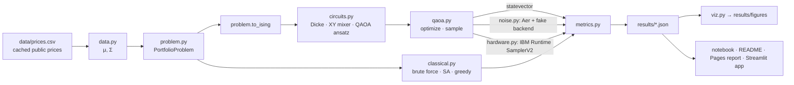

# 02 · Architecture

## Data flow



## Package layout

```
src/qportfolio/
├── __init__.py        # version, public API re-exports
├── config.py          # load configs/default.yaml → frozen dataclass; config hash
├── data.py            # load_prices, returns_stats, synthetic_instance
├── problem.py         # PortfolioProblem, bitstring_to_x, x_to_bitstring
├── classical.py       # brute_force, simulated_annealing, greedy
├── circuits.py        # dicke_state, xy_ring_mixer, build_qaoa
├── qaoa.py            # optimize, sample, linear_ramp_init
├── metrics.py         # evaluate_counts, approximation_ratio
├── benchmark.py       # robustness_specs, run_instance, summarise (pure; script does I/O)
├── noise.py           # fake_backend_sampler, transpile_report, postselect, readout_mitigate
├── hardware.py        # backend, transpile + readout-cal PUBs, SamplerV2 options, scoring
├── viz.py             # one function per figure
├── io.py              # save_result / load_result (JSON + metadata)
└── demo.py            # `python -m qportfolio.demo` – checkpoint demo
```

## Public interfaces (signatures are binding)

```python
# data.py
def load_prices(path: str | Path = "data/prices.csv", tickers: list[str] | None = None,
                start: str | None = None, end: str | None = None) -> pd.DataFrame: ...
def returns_stats(prices: pd.DataFrame, periods: int = 252) -> tuple[np.ndarray, np.ndarray]: ...
def synthetic_instance(n: int, seed: int) -> tuple[np.ndarray, np.ndarray]: ...

# problem.py
@dataclass(frozen=True)
class PortfolioProblem:
    mu: np.ndarray; sigma: np.ndarray; k: int; q: float = 0.5
    labels: tuple[str, ...] | None = None
    @property
    def n(self) -> int: ...
    def cost(self, x: np.ndarray) -> float: ...                       # q xᵀΣx − μᵀx  (minimise)
    def feasible_set(self) -> np.ndarray: ...                         # shape (C(n,k), n)
    def to_qubo(self, penalty: float = 0.0) -> tuple[np.ndarray, float]: ...   # (Q, const)
    def to_ising(self, penalty: float = 0.0, normalize: bool = True) -> SparsePauliOp: ...
    def default_penalty(self) -> float: ...
def bitstring_to_x(bits: str) -> np.ndarray: ...   # handles Qiskit little-endian
def x_to_bitstring(x: np.ndarray) -> str: ...

# classical.py
@dataclass
class ClassicalResult: x: np.ndarray; cost: float; evaluations: int; seconds: float; method: str
    samples: np.ndarray | None = None   # SA: final x of every read, for P(optimal) over reads
def brute_force(p: PortfolioProblem) -> tuple[ClassicalResult, np.ndarray]: ...  # (best, all feasible costs)
def simulated_annealing(p: PortfolioProblem, penalty: float, sweeps: int, seed: int,
                        reads: int = 1) -> ClassicalResult: ...  # reads = classical.sa_reads
def greedy(p: PortfolioProblem) -> ClassicalResult: ...

# circuits.py
def dicke_state(n: int, k: int) -> QuantumCircuit: ...
def xy_ring_mixer(n: int) -> QuantumCircuit: ...                    # 1 Parameter β
def build_qaoa(p: PortfolioProblem, reps: int, variant: Literal["penalty", "xy"],
               penalty: float | None = None) -> tuple[QuantumCircuit, SparsePauliOp]: ...

# qaoa.py
@dataclass
class QAOAResult: params: np.ndarray; energy: float; history: list[float]; nfev: int; seconds: float
def optimize(ansatz, hamiltonian, restarts: int, maxiter: int, seed: int) -> QAOAResult: ...
def sample(ansatz, params, sampler=None, shots: int = 4096,
           seed: int | None = None) -> dict[str, int]: ...  # seed → default StatevectorSampler

# metrics.py
def evaluate_counts(counts: dict[str, int], p: PortfolioProblem,
                    feasible_costs: np.ndarray, best_x: np.ndarray) -> dict[str, float]: ...
# keys: p_feasible, p_optimal, p_optimal_postselected, p_top2, approx_ratio, top1_is_optimal, expected_cost, shots

# benchmark.py  (methods: random, brute_force, greedy, simulated_annealing,
#                penalty_qaoa_p1..2, xy_qaoa_p1..3; all scored by evaluate_counts)
def robustness_specs(universe, size, q_values, instances, seed) -> list[tuple[tuple[str, ...], float]]: ...
def random_baseline(costs: np.ndarray) -> dict: ...                # analytic floor
def run_instance(p, settings: dict, seed: int, keep_counts: bool = False) -> dict: ...
def summarise(instances: list[dict]) -> dict: ...                  # mean ± std per method
def gap_stats(instances: list[dict]) -> dict: ...                  # optimum vs runner-up gap
def scaling_rows(ns=(4, 6, …, 14), seed=0) -> list[dict]: ...      # C(n,k), 2ⁿ, p=1 XY 2q gates
def solve_live(mu, sigma, labels, k, q, reps, settings, seed) -> dict: ...  # Streamlit tab 1

# noise.py
def fake_backend(name: str = "FakeTorino"): ...
def transpile_report(circ, backend, levels=(0, 1, 2, 3), seed: int = 0) -> pd.DataFrame: ...
def estimated_fidelity(tc, backend) -> float: ...                  # Π(1 − error) over gates + measures
def run_noisy(circ, backend, shots: int, seed: int, level: int = 3) -> tuple[dict[str, int], list[int]]: ...  # (counts, layout)
def postselect(counts, k: int) -> dict[str, int]: ...
def readout_calibration(backend, layout, shots, seed) -> list[np.ndarray]: ...   # per-qubit 2×2
def readout_mitigate(counts, cal_mats) -> dict[str, float]: ...  # tensored inverse, clipped & renormalised
# noise.py reuses hardware.py's calibration_circuits / readout_matrices / readout_mitigate, so the
# simulated study and the real IBM job are mitigated by identical code.

# hardware.py  (one job = all QAOA depths + 2 readout-calibration PUBs; see docs/06)
# NOTE (2026-10-08): replaces submit()/collect(). Submit/status/collect orchestration lives in
# scripts/run_hardware.py (I/O); this module holds the pure / backend-facing pieces.
# readout_matrices / readout_mitigate live here and are re-used by noise.py.
def get_backend(name: str | None, dry_run: bool, min_qubits: int = 8) -> BackendV2: ...  # FakeTorino if dry_run
def fetch_job(job_id: str) -> RuntimeJobV2: ...
def cost_gap(p: PortfolioProblem) -> dict: ...          # best / second-best basket and their gap
def calibration_circuits(n: int) -> list[QuantumCircuit]: ...   # all-0, all-1
def readout_matrices(counts0, counts1, n: int) -> list[np.ndarray]: ...   # M[measured, prepared]
def readout_mitigate(counts, cal_mats) -> dict[str, float]: ...
def transpile_pubs(qaoa_circuits, backend, seed) -> tuple[list[QuantumCircuit], list[list[int]], list[int]]: ...
def is_fake_backend(backend) -> bool: ...
def sampler_options(shots, seed, dd: bool, twirl: bool, simulator: bool) -> dict: ...  # no simulator.* for real devices
def configure_sampler(backend, shots, seed, dd: bool, twirl: bool) -> SamplerV2: ...
def circuit_stats(tc) -> dict: ...                       # depth, two_qubit_gates
def backend_snapshot(backend, qubits) -> dict: ...       # median T1/T2, readout and 2q error
def summarise(p, pub_counts, meta) -> dict: ...          # raw / post-selected / mitigated metrics
```

## Scripts (I/O lives here)
| Script | Does |
|---|---|
| `scripts/fetch_data.py` | yfinance → `data/prices.csv` + `prices.meta.json` (the only network access) |
| `scripts/show_instance.py` | prints μ, Σ, all C(n,k) feasible baskets sorted by cost, and the optimum |
| `scripts/run_benchmark.py` | multi-instance classical vs penalty-QAOA vs XY-QAOA → `results/benchmark.json` |
| `scripts/run_noisy.py` | transpile table + noisy runs + mitigation → `results/noisy.json` |
| `scripts/run_hardware.py` | `--dry-run` (FakeTorino, same SamplerV2 path) / `--submit` / `--status` / `--collect` → `results/hardware/<job_id>.json` |
| `scripts/make_figures.py` | all figures from `results/*.json` |
| `scripts/fill_readme.py` | regenerates the README results tables from JSON (between `<!-- RESULTS:START -->` / `END` markers); last step of `reproduce` |
| `scripts/make_slides.py` | builds the 3-slide deck `docs/slides.pptx` (numbers from JSON, figures from `results/figures/`) |
| `scripts/export_pdf.py` | Markdown → HTML → PDF via Edge/Chrome headless (used for `docs/BUSINESS_BRIEF.pdf`) |
| `scripts/build_report.sh` | executes the notebook → HTML → `site/` |
| `scripts/build_landing.py` | writes `site/index.html` (results table from `results/*.json`) |

## Config (`configs/default.yaml`)
```yaml
seed: 2026
data: {path: data/prices.csv, start: "2023-01-01", end: "2025-12-31",
       tickers: [RELIANCE.NS, TCS.NS, HDFCBANK.NS, INFY.NS, ITC.NS, LT.NS]}
problem: {k: 3, q: 0.5}
hardware_problem: {tickers: [RELIANCE.NS, TCS.NS, HDFCBANK.NS, ITC.NS], k: 2, q: 0.5}
qaoa: {reps: [1, 2, 3], restarts: 8, maxiter: 300, shots: 8192}
benchmark: {instances: 20, universe_size: 6, k: 3, q_values: [0.25, 0.5, 1.0]}
classical: {sa_sweeps: 2000}
noise: {backends: [FakeTorino, FakeFez], opt_levels: [0, 1, 2, 3]}
hardware: {backend: null, shots: 8192, dynamical_decoupling: true, twirling: true}
```

## Results schema (`results/*.json`)
`benchmark.json`: instance 0 is the headline real-data instance (`"kind": "headline"`, also stored
raw counts + every basket's risk/return); instances 1..24 are `"kind": "robustness"`. `summary`
is mean ± std (ddof 0) over the **robustness set only**; `headline` repeats instance 0's methods.

```json
{"meta": {"created": "ISO-8601", "git_sha": "…", "config_hash": "…", "versions": {"qiskit": "2.x", "…": "…"}},
 "instances": [{"id": 0, "tickers": ["…"], "k": 3, "q": 0.5,
                "optimum": {"x": [1,0,…], "cost": -0.12},
                "methods": {"brute_force": {"p_optimal": 1.0, "seconds": 0.0001, "…": "…"},
                            "xy_qaoa_p2": {"p_optimal": 0.36, "p_feasible": 1.0, "approx_ratio": 0.81, "…": "…"}}}],
 "summary": {"xy_qaoa_p2": {"p_optimal_mean": 0.0, "p_optimal_std": 0.0, "…": "…"}}}
```
