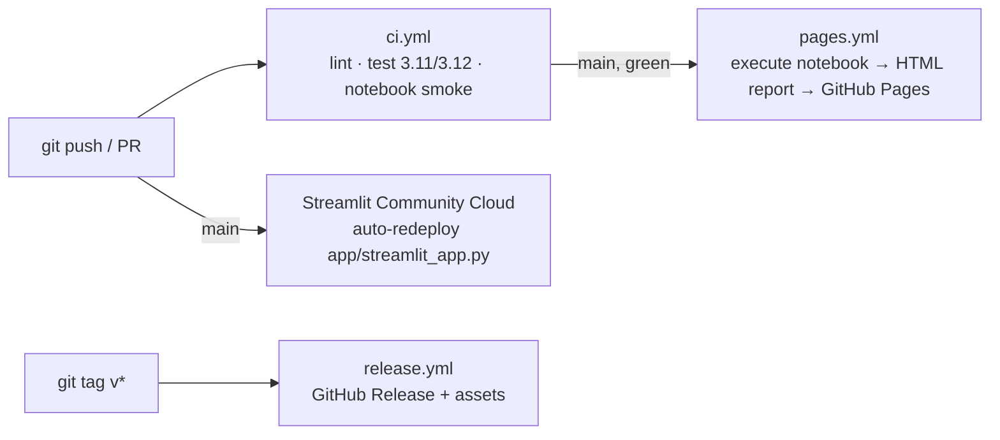

# 07 · CI/CD and deployment

## Overview



| Workflow | Trigger | Jobs | Time |
|---|---|---|---|
| `ci.yml` | push, PR | `lint` (ruff), `test` (pytest, matrix py3.11/3.12, fast tests), `notebook` (nbmake with `QFOLIO_FAST=1`) | ~4 min |
| `pages.yml` | push to `main` (after CI), manual | executes the notebook + `make_figures` → `site/` → deploys to Pages | ~5 min |
| `release.yml` | tag `v*` | builds a source zip + attaches `docs/BUSINESS_BRIEF.pdf`, `docs/slides.pdf`, `results/` | ~1 min |

All workflows run **offline** (data cached, simulators only). No secrets are needed. The IBM token is **never** used in CI.

## 1. GitHub repository setup (one time)
```bash
gh repo create qfolio --public --source . --remote origin \
  --description "Constraint-preserving QAOA for portfolio selection, Qiskit Fall Fest 2026" --push
gh repo edit --add-topic qiskit,qaoa,quantum-computing,portfolio-optimization,ibm-quantum,hackathon
gh repo edit --enable-issues --enable-wiki=false
```
- **Settings → Pages → Source: GitHub Actions.**
- Settings → Branches → protect `main`: require the `ci` status check. Optional for a solo hackathon, but it looks professional.
- Add the repo URL, Pages URL and app URL to the "About" box.

## 2. GitHub Pages report
`scripts/build_report.sh`:
1. `jupyter nbconvert --to html --execute notebooks/qfolio.ipynb --output-dir site/`
2. copies `results/figures/*` → `site/figures/`
3. writes `site/index.html`: a landing page with the headline figure, the results table (from JSON), and links to the notebook HTML, repo, app, brief and video.

URL: `https://achintya007-arch.github.io/qfolio/`

## 3. Streamlit app (live demo)
- Entry point: `app/streamlit_app.py`; dependencies come from root `requirements.txt` (Streamlit Cloud reads it automatically).
- Deploy: **share.streamlit.io → New app → repo `achintya007-arch/qfolio`, branch `main`, file `app/streamlit_app.py`** → custom subdomain `qfolio` (if taken, pick another and update the README badge).
- It auto-redeploys on every push to `main`.
- Runtime budget: statevector XY-QAOA with n ≤ 6 and p ≤ 2, 4 restarts, cached with `@st.cache_data`. Precomputed `results/` are shown for the noise and hardware tabs.
- App tabs: **① Build basket** (tickers, k, q → brute-force vs XY-QAOA, distribution plot, risk/return frontier) · **② Why XY beats penalty** · **③ Noise & hardware** (ladder figure, job ID link) · **④ Limits**.

Fallback if Streamlit Cloud is slow or down: Hugging Face Spaces (Docker SDK) with the same `requirements.txt`. The Pages report is the primary deployment.

## 4. Releases
```bash
git tag -a v1.0.0 -m "Qiskit Fall Fest 2026 submission"
git push origin v1.0.0          # release.yml creates the GitHub Release
```
Tag **before** submitting the form and put the release URL in the submission. Any later fixes go in `v1.0.x` with a CHANGELOG entry. The judges see exactly what was submitted.

## 5. Local equivalents
`make lint test notebook report app` reproduces every CI step locally.
